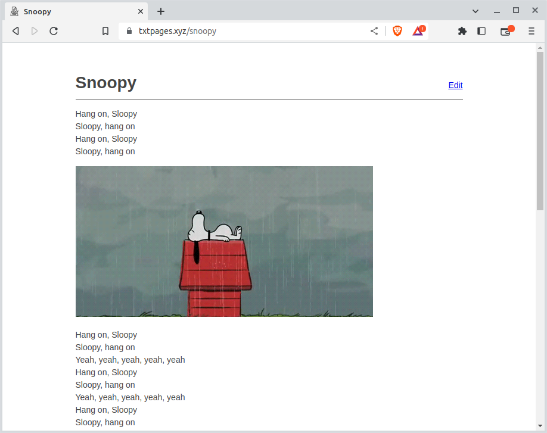

## About TxtPages

Create plain text webpages with a unique url you can link to.

TxtPages is a clone of the popular [Txti](https://txti.es/) tool for creating fast text web pages.

TxtPages will always be free and open source. Feel free to copy the code and deploy to your own hosting service. Spread TxtPages all across the web!

## Build and Install

```
$ make dep
$ make
$ ./txtpages -i pages.db

Run 'txtpages pages.db' to start the web service.
```

TxtPages uses a single sqlitie3 database file to store all txtpages.

## Screenshots




## Contact

```
Twitter: @robcomputing
Source: https://github.com/robdelacruz/txtpages
```

